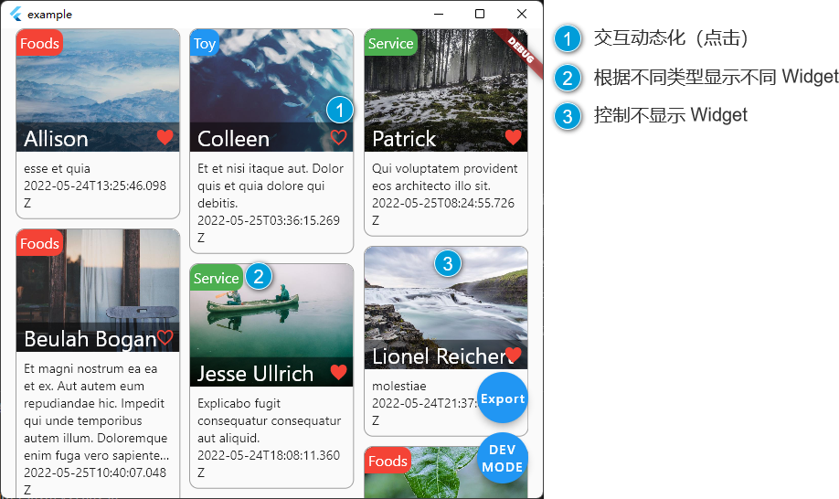

Build your Dynamic components that support simple logic and variable

See also: https://pub.dev/packages/dynamic_component

## Features

- [x] Dynamic variable  
- [x] Dynamic UI  
- [x] UI Logic  
  - [x] If Or Not
  - [x] Tap Event (Multiple)
  - [x] When
- [x] codegen

## Preview

